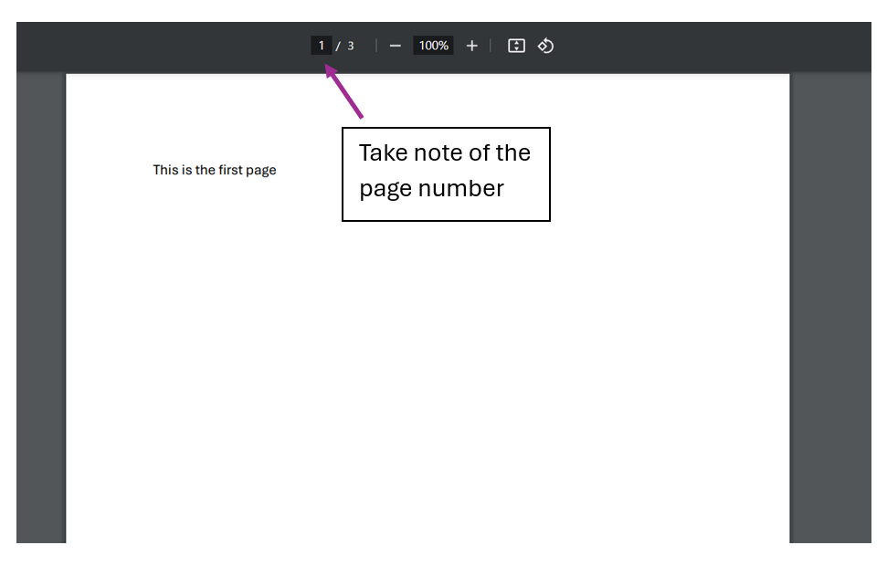

<frontmatter>
  title: Typical Workflow
</frontmatter>

 

# Typical Workflow

PDFix is not meant to be used as a standalone tool. It should be used to complement other document tools. For instance, a pdf viewer like Adobe Acrobat should be used alongside PDFix to view and determine the pages to remove.

This is what a typical workflow for PDFix may look like for removing some pages off a pdf file:

1. Open the pdf file in a pdf viewer such as Adobe Acrobat or your browser

2. Take note of the pages that you want to remove from the pdf file

3. Run the [`removePages`]() command from the command line

After the 3 steps have been ran, the updated pdf file will be stored in a seperate folder named `updated` in the same location as the pdf file
